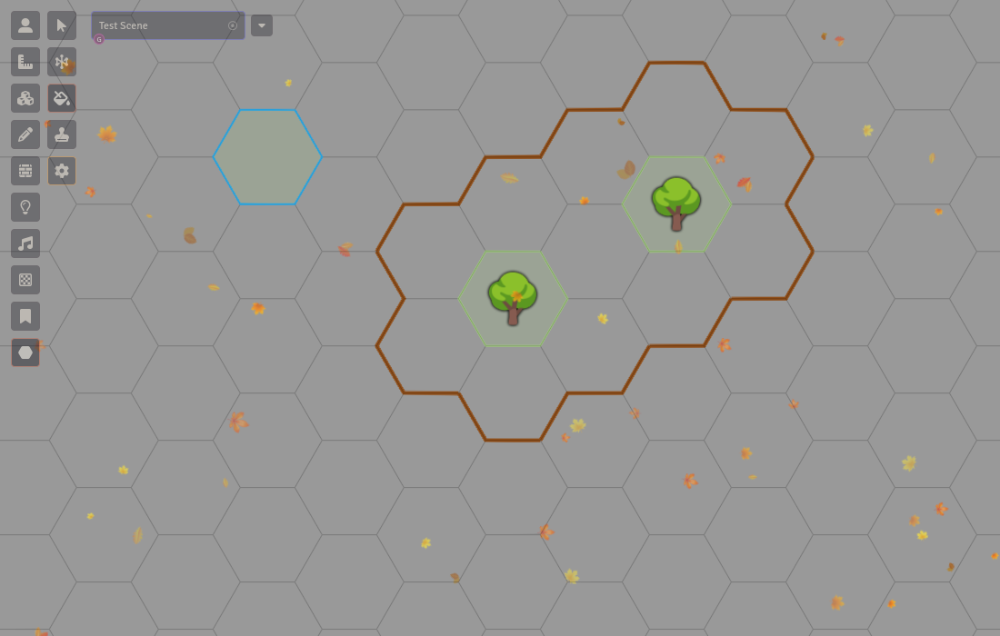

# hexagons

[Hexagons](https://foundryvtt.com/packages/hexagons) is a simple Foundry VTT add-on that provides enhanced drawing capabilities for hex grids (either for Hex Crawls or for hex-based tactical encounters such as battles in the [d12 system](https://d12.nexus)).

Install by searching for "hexagons" in the Foundry VTT Add-on Modules tab, or by linking directly to the `manifest.json` of the latest GitHub release in this project.

  
  

All tools will snap features to the hex grid of the current map, making it very easy to add features, terrain and annotations to your hex maps.

Note: the toolbar will only appear when a hex grid is detected on the current scene. The package support all four configurations of hex grids available in Foundry.

## Tools

- **Select Tool**: Select and manipulate existing drawings on the hex grid, allowing movement snapped to the lattice.

- **Line Tool**: Draw "straight" lines that snap to the hex grid lattice.

- **Paint Tool**: Fill individual hexes on the map (including a thin border).

- **Stamp Tool**: Place icons (Unicode emojis) centred within hexes. Right click to choose a new stamp, left click to repeat previous stamp.

- **Configuration Modal**: Easy access to change the colors and stroke used by each tool.

## Contributing

All contributions are more than welcome! Please send us a PR or use the issue tracker for any bugs or requests.
